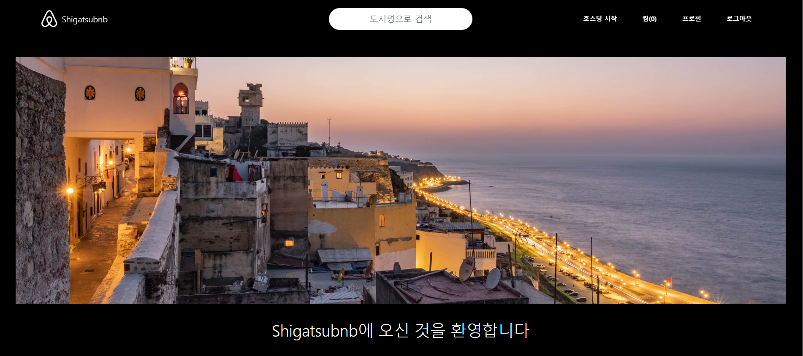
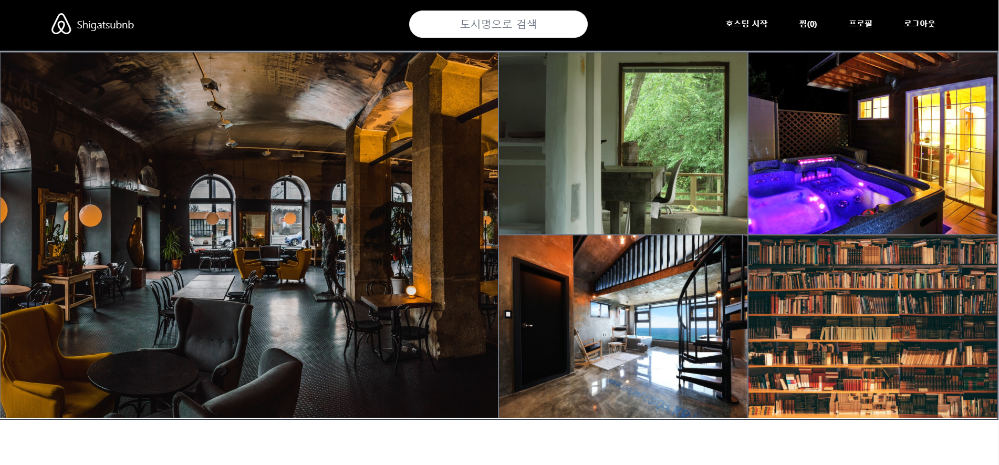
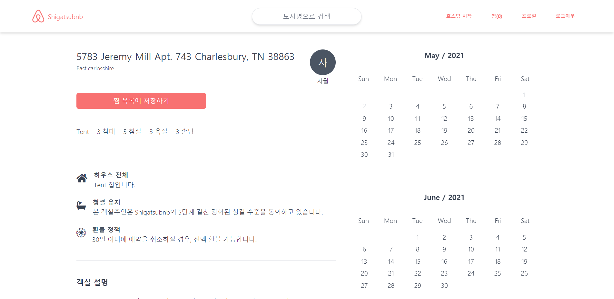
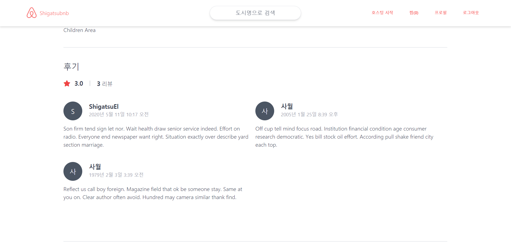
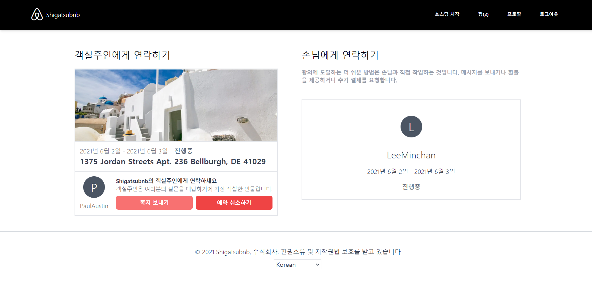
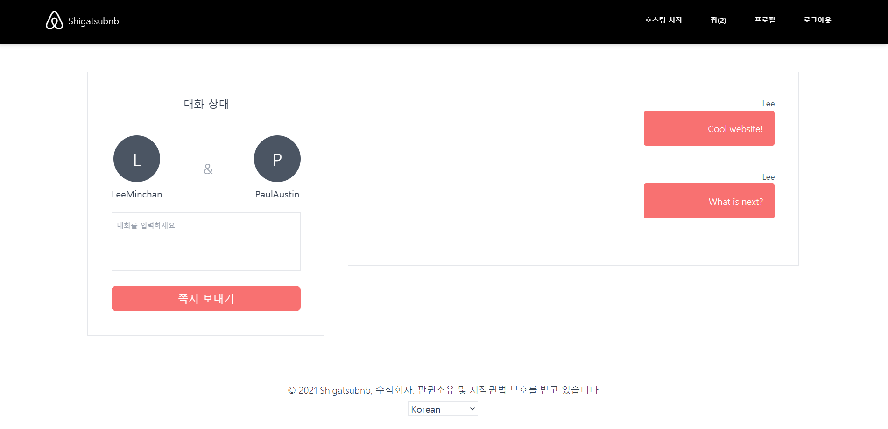

# Shigatsubnb

Cloning Aribnb with Python, Django and Tailwind CSS

## Demo

[Shigatsubnb](http://shigatsubnb-clone.eba-bwmv4jgs.ap-northeast-2.elasticbeanstalk.com/)

## Preview














## Tech Stack

| Frontend |     Technology     |  Description  |
| :------: | :----------------: | :-----------: |
|    01    |  Django Template   | HTML Template |
|    02    |    Tailwind CSS    |      CSS      |
|    03    | Vanilla JavaScript |  JavaScript   |

| Backend |     Technology     |    Description    |
| :-----: | :----------------: | :---------------: |
|   01    |       Django       | Backend Framework |
|   02    |     Django ORM     |     Database      |
|   03    | Elastick Beanstalk |      Server       |
|   03    |         S3         |      Storage      |
|   04    |        RDS         | Select PostgreSQL |

## Data Struture

```
.ebextensions
|-- 01-pacakges.config
|-- 02-django.config
.elasticbeanstalk
|-- config.yml
.vscode
|-- settings.json
assets
|-- scss
config
|-- asgi.py
|-- custom_storages.py
|-- settings.py
|-- urls.py
|-- wsgi.py
conversations
|-- migrations
|-- admin.py
|-- apps.py
|-- forms.py
|-- models.py
|-- test.py
|-- urls.py
|-- views.py
core
|-- migrations
|-- admin.py
|-- apps.py
|-- managers.py
|-- models.py
|-- test.py
|-- urls.py
|-- views.py
lists
|-- management
|-- migrations
|-- admin.py
|-- apps.py
|-- models.py
|-- test.py
|-- urls.py
|-- views.py
locale
|-- ko
|   |-- LC_MESSAGES
|   |   |-- django.mo
|   |   |-- django.po
node_modules
reservations
|-- management
|-- migrations
|-- admin.py
|-- apps.py
|-- models.py
|-- test.py
|-- urls.py
|-- views.py
reviews
|-- management
|-- migrations
|-- admin.py
|-- apps.py
|-- forms.py
|-- models.py
|-- test.py
|-- urls.py
|-- views.py
rooms
|-- management
|-- migrations
|-- templatetags
|-- admin.py
|-- apps.py
|-- forms.py
|-- models.py
|-- test.py
|-- urls.py
|-- views.py
static
|-- css
template
|-- converstions
|-- emails
|-- lists
|-- mixins
|   |-- auth
|   |-- room
|   |-- search
|-- reservations
|-- rooms
|-- users
uploads
|-- avatars
|-- room_photos
users
|-- management
|-- migrations
|-- admin.py
|-- apps.py
|-- forms.py
|-- mixins.py
|-- models.py
|-- test.py
|-- urls.py
|-- views.py
```

## Screens

- Home(Core)
  - Read
- Room
  - Create
  - Update
  - Search
  - Photo
    - Read
    - Create
    - Update
    - Delete
- User
  - Log In
  - Github Login
  - Kakao Login
  - Log Out
  - Sign Up
  - Read Profile
  - Update Profile
  - Update Password
- Review
  - Create
- Reservation
  - Read
  - Create
  - Update
- List
  - Read
  - Create
  - Delete
- Conversation
  - Read
  - Create
  - Update

## Development Memoirs

Shigatsubnb를 개발하면서 느낀점을 생각해보며 회고록을 작성한다.

### Node VS Django

꽤 예전에 Node를 사용해 백엔드를 구축한 경험이 있다.<br>

백엔드를 만든 적은 Node를 사용했을 때가 처음으로 그때 당시 아무것도 없는 상황에서 단 몇줄의 코드로 서버를 만들어내는 것이 매우 매력적이었다.<br>

하지만 지금 Django로 백엔드를 만들어보면서 느꼈던 점은 Node에 비해 Django가 훨씬 더 빠르고 안정적이게 구축할 수 있었다는 것이다.<br>

Node Express는 프레임워크 치고는 굉장히 자유로워서 내가 원하는 파일에 라우트나 컨트롤러를 만들 수 있었다는 장점이 있었지만 점점 더 큰 백엔드를 구축할수록 이것이 단점으로 변하게 되었다.<br>

어디에 존재하는지 까먹어서 이곳저곳 찾아야 하는 반면, Django는 제시한 룰을 지키지 않으면 에러가 발생하기 때문에 url만 모아두는 파일, view를 보여주는 파일 이름이 정해져있어 내가 절대 까먹을 일이 없게 도와주었다.<br>

또한 NodeJS에는 없는 강력한 admin패널과 이미 구현되어 있는 User 인증, 심지어 유저를 커스터마이징을 할 수 있는 기능을 탑재하고 있었다.<br>

그 외에 뷰, 템플릿, 폼 등 모든 것이 최적화되어 있었으며 시작부터 모든 것을 구현해야 하는 Node와는 달랐다.<br>

이는 굉장히 많은 시간을 절약해줄 것이며 수고로움을 덜어줄 것이다.<br>

물론 모든 경우에 Django가 좋다고 할 수는 없지만 내가 만약 CRUD가 중점이 되는 웹사이트를 다시 만들게 된다면 Node 대신에 Django를 선택할 것 같다.<br>

### Elastic Beanstalk

백엔드를 한 번 구축해본 경험이 있어서 그런지 개발과정은 매우 순조롭게 진행되었다.<br>

가장 어려웠던 점은 서버를 배포하는 과정과 데이터베이스를 옮기는 것, 그리고 저장소를 새로 만드는 것이었던 것 같다.<br>

예전에는 heroku를 통해서 1~2시간 정도 소요해서 어려움 없이 배포했었는데 처음으로 AWS를 사용해보니 용어가 너무 낯설고 어렵게 느껴졌다.<br>

심지어 서버 설정을 내가 직접한 것도 아니고 Elastic Beanstalk이 다 해주는데도 말이다.<br>

그래도 배포과정을 전반적으로 체험해보고 나니 지금은 그래도 다시 해보라고 한다면 할 수 있을 듯 싶다.<br>

마지막으로 배포하고 난 후에 몇가지 안되는 것(소셜 로그인 및 static file limit)등의 문제가 있었는데 소셜 로그인은 해결했고 static file limit 문제는 eb가 배포한 후에 3mb이상의 file을 업로드 하는 것을 막는 것 같다.<br>

시간이 나는대로 해결할 예정이며 추후 발생할 문제도 조치할 예정이다.<br>

## Move Forward

### React + Django

Django를 사용하면 빠른 시간 내에 백엔드를 구축할 수 있을 것 같은데 이를 실시간으로 업데이트하는 React와 함께 사용해 보고 싶다.<br>

아직 개인 프로젝트와 Tsuber Eats Clone이 남아있지만 Tsuber Eats를 만들면서 사용한 NestJS도 상당히 매력적이라 다음 개인 프로젝트에 React + Nest 또는 React + Django를 선택해 풀스택으로 앱을 배포해보는 것이 목적이다.<br>

### Django

Django가 제공하는 것이 너무 많아 아직 50~60? % 정도로밖에 활용하지 못하는 것 같다.<br>

추후에 Django를 사용하게 된다면 꼭 해보지 않은 방법으로 시도해서 Django를 좀 더 배워봐야겠다.